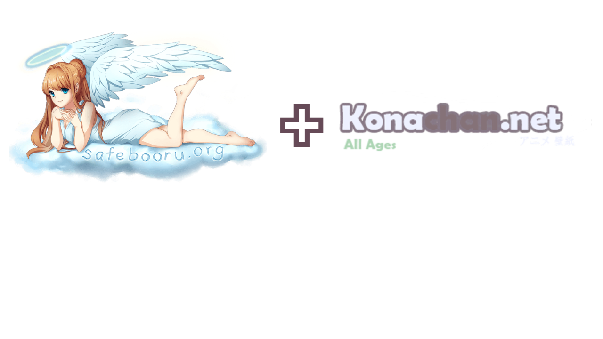

# Booru3DS (SFW)

<p align="center">
  
</p>


A booru image board browser for the **Nintendo 3DS**, written in C with
citro2d/citro3d. Browse Safebooru or Konachan, view images on the top
screen, and save full-size originals to your SD card — or install them
straight into the Nintendo 3DS Camera app.

## Features

- **Two image boards** — switch between `safebooru.org` and `konachan.net`
  with `SELECT` (both SFW).
- **Explore images** — Browse up to 100 recently-added images from a tag;
  D-Pad / L / R / touch to navigate.
- **Full-size viewer** — the selected post renders large on the top screen,
  first from the thumbnail cache, then sharpened when the full preview
  arrives.
- **Save to SD** (`A` -> `A`) — streams the original file to
  `sdmc:/3ds/booru/` with no size limit (nothing large is ever held in RAM).
- **Install to 3DS Camera** (`A` -> `X`) — converts any downloaded image
  into a photo the Nintendo 3DS Camera app displays natively, complete
  with EXIF timestamps.
- **Search history** — Up to 8 queries can be saved on the search history.
  these remain on next boot, and can be opened anytime with Y

## Controls

| Button | Action |
| ------ | ------ |
| A | Open save prompt (in grid) / confirm "save to booru folder" |
| X | Search (also: tap search bar) / confirm "install to camera" |
| B | Back to title screen / cancel prompt |
| SELECT | Switch board (safebooru.org <-> konachan.net) |
| L / R | Previous / next page |
| D-Pad | Move selection |
| START | Exit |
| Y | Search history |

## Building

Requires [devkitARM](https://devkitpro.org/) with libctru, citro2d,
citro3d, and turbojpeg from portlibs:

```sh
pacman -S 3ds-libctru 3ds-citro2d 3ds-citro3d 3ds-libjpeg-turbo
make
```

`stb_image.h` is vendored in `source/`; everything else is standard
devkitPro toolchain. Output is `booru3ds.3dsx` — run it with your favourite
homebrew launcher.

## Camera install caveats

The Nintendo 3DS Camera app was never meant to accept foreign photos, so a
few quirks apply. The 3DS Camera implementation is based on [SCR2JPG](https://github.com/Adrix12team/SCR2JPG)

## Two different providers

That way, if one API falls or becomes outdated, the other serves as a backup.
In this case, Konachan is the backup, as it holds less images than Safebooru.

NO PLAN IS MADE TO SUPPORT OTHER PROVIDERS. We plan to keep this app fully SFW
in order to comply with Universal-DB's guidelines. If you want to fork the repo 
and add your own provider support; you're free to do so.

## Credits

- [SCR2JPG](https://github.com/Adrix12team/SCR2JPG) — reference for the
  DCIM conventions that make the camera accept imported photos.
- [stb_image](https://github.com/nothings/stb) — PNG/BMP decoding.
- devkitPro, libctru, citro2d/citro3d, libjpeg-turbo, cURL/mbedTLS.
